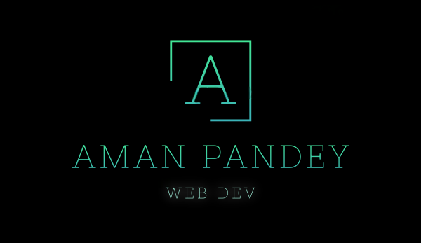

<h1 align="center">Hey there, I'm Aman Pandey 👋</h1>

  

  🚀 Full Stack Developer | JavaScript Junkie | Building cool stuff on the web  

---

### 👨‍💻 About Me

- 🔭 I’m currently working on **full stack web projects** and exploring modern tech stacks
- 🌱 Learning TypeScript and diving deeper into DSA with C++
- 🧠 Always curious about backend systems and how things scale
- 💬 Ask me about web dev, Node.js, MongoDB, React, or just tech in general!
- 📫 Reach me at **amandbz5909@gmail.com**

---

### 🛠️ Tech Stack

#### 🌐 Frontend:

#### 🖥️ Backend:

#### 🧱 Databases:

#### 🧰 Tools & Packages:

---

### 🔥 GitHub Stats

  

  

  

---

### 📌 Featured Projects

- 🎬 [KnowAMovie](https://github.com/Aman-pandey-5909/KnowAMovie)  
  A slick movie search and discovery app powered by OMDb API and built with love.

- 🖼️ [Pictomangle](https://github.com/Aman-pandey-5909/pictomangle)  
  Basic Image processing and handling package built using Nodejs and Sharp.

---

### 📡 Connect with Me

---

> “Code. Learn. Build. Repeat.” — Aman Pandey
